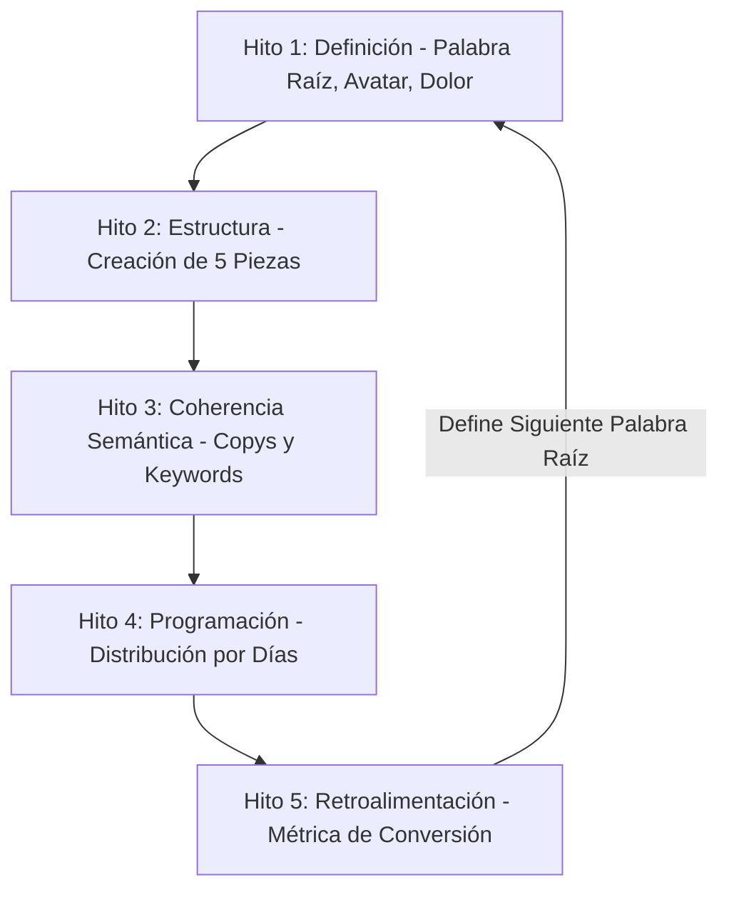

# 📅 ESTRATEGIA MARCA PERSONAL CÉSAR REYES — CALENDARIO MAESTRO 30 DÍAS
**Versión:** 3.1 (Carril Dual: Serie Documental + Calendario Semanal) | **Creado:** 2026-06-21 | **Integrado por:** Jarvis
**Fuente:** ADN César Reyes Jaramillo v2.0, Conversación de Planificación Semana 1 y Casos Reales (Yessy, Titanos)

---

## 🏛️ 1. SISTEMA DE MARCA PERSONAL Y FILTRO DE CLIENTES

### Premisa Base
César no habla de productos en su marca personal. Habla de **dolores operativos** que sus servicios resuelven. El mismo contenido atrae distintos tamaños de cliente, y el contexto del lead determina qué se le vende.

### Los Tres Dolores Centrales a Atacar
1. **Falta de visibilidad real:** No métricas de vanidad, sino captura real de intención de compra (ej: que te busquen por categoría, no por nombre).
2. **Caos operativo:** Desorden y retrasos críticos en la atención de mensajes y leads por WhatsApp/redes.
3. **Fuga de capital:** Invertir dinero en pauta publicitaria (Ads) sin contar con un sistema automatizado de respuesta y calificación inmediata.

### Regla de Oro del Contenido
> [!IMPORTANT]
> **Nunca mencionar el producto. Siempre hablar del problema. El cliente llega solo.**

### 💰 Criterio de Precio por Contexto (Innegociable)
El precio no es fijo. Lo determina el contexto del lead:
* **Unipersonal sin equipo:** Se redirige obligatoriamente a soluciones empaquetadas como **ActivaQR**.
* **Empresa con estructura:** Gerentes o directivos que responden a terceros o asambleas van a **Consultoría/Desarrollo a Medida desde $2,000**.
* **Regla de oro de la venta:** César nunca llega con precio, llega con preguntas. Las preguntas definen el producto y revelan el tamaño de la fuga de capital.

### Filtro de Clientes — Alejandra (Máximo 3 Interacciones)
Para evitar perder leads valiosos o quemar el tiempo de César, Alejandra opera bajo un límite estricto de **3 interacciones** antes de escalar:

1. **Pregunta Clasificatoria:** *"¿Tienes alguien que atiende tus mensajes o lo haces tú solo?"* (Clasifica tamaño del negocio, nivel de dolor y presupuesto en 2 segundos).
2. **Reflejo del Dolor (Espejo):** Reflejar el dolor en las palabras del propio lead y pedir confirmación (*"Entonces me dices que tienes X problema, ¿correcto?"*).
3. **Pregunta de Expectativa:** *"¿Qué resultado específico estás buscando?"*

#### Regla de Escalada y Silencio
Cuando el lead confirma su dolor y expectativa, Alejandra **no sigue conversando**. Envía de inmediato un resumen a César con tres datos: **tamaño del negocio, dolor confirmado y expectativa**, indicándole al lead: *"César te contactará personalmente."*
* **Prohibición absoluta:** Alejandra nunca da precios, nunca improvisa soluciones y nunca sigue preguntando si el lead ya mostró intención clara.

---

## 📅 2. PSICOLOGÍA DEL CALENDARIO SEMANAL

### Principio Base
Cada día de la semana corresponde a un estado mental del dueño de negocio. El contenido se diseña para ese estado, no para el antojo del creador.

### Estructura Semanal de Publicación
* **Domingo (El Sacudón / Ansiedad):** Reel corto de dolor puro (menos de 60s). Sin solución. Solo abrir el vacío y evidenciar el dolor. El empresario experimenta ansiedad por el inicio de la semana laboral.
* **Lunes (Acción / La Solución Directa):** Carrusel o reel largo con caso real. Lo comercial disfrazado de reto o resultado concreto. El empresario busca soluciones directas para optimizar su semana.
* **Martes y Miércoles (Credibilidad / Operación):** Testimonio real con comentario encima, o dato incómodo de experiencia real de campo. Días de alta operación; el contenido debe construir credibilidad incuestionable.
* **Jueves (Captura / Facilidad):** Reel de reacción o captura de audiencia nueva (pantalla dividida con tendencias). El cansancio operativo empieza, el contenido debe ser fácil de consumir.
* **Viernes (Conversión / CTA Directo):** Historias con llamada a la acción (CTA) directo a Alejandra para cerrar la semana con leads calificados en el bot.
* **Sábado (Filosofía / Desconexión):** Nada, o una pieza filosófica muy corta sobre activos B2B o mentalidad. La audiencia descansa, César también.

### Regla de Coherencia Semántica
Cada semana tiene una **sola palabra raíz**. Todos los títulos, descripciones, hashtags y subtítulos de esa semana derivan de esa palabra. Esto permite que el algoritmo agrupe el contenido y recomiende las piezas entre sí.

### Retroalimentación Semanal
Al cierre de cada semana, la métrica que importa no son las vistas sino **cuántas conversaciones generó Alejandra**. Ese indicador define la palabra raíz de la semana siguiente.

---

## 🏆 3. PROTOCOLO SEMANAL DE CONTENIDO (5 HITOS DE EJECUCIÓN)



* **HITO 1 — DEFINICIÓN (Domingo, antes de grabar):**
  * Definir la palabra raíz de la semana.
  * Identificar el avatar objetivo dominante.
  * Seleccionar el dolor específico a atacar.
  * Elegir un caso real o dato de experiencia propia como ancla.
* **HITO 2 — ESTRUCTURA DE PIEZAS:**
  * 1 reel de dolor puro, sin solución, menos de 60 segundos.
  * 1 reel largo o carrusel con el caso real.
  * 1 testimonio editado con comentario de César encima.
  * 2 historias con CTA directo a Alejandra.
  * 1 pieza filosófica o de reacción como comodín.
* **HITO 3 — COHERENCIA SEMÁNTICA:**
  * Todos los títulos y descripciones derivan de la palabra raíz.
  * Hashtags consistentes en todas las piezas de la semana.
  * Subtítulos generados con las mismas palabras clave de base.
* **HITO 4 — PROGRAMACIÓN:**
  * Domingo dolor, lunes acción, martes/miércoles credibilidad, jueves captura, viernes CTA.
* **HITO 5 — RETROALIMENTACIÓN:**
  * Al cierre de semana: evaluar qué pieza generó más conversaciones de calidad con Alejandra. Eso define la palabra raíz de la semana siguiente.

---

## 🚀 4. EJECUCIÓN SEMANA 1 — PALABRA RAÍZ: INVISIBLE

Para el arranque oficial, César opera bajo una estructura de **Carril Dual** para maximizar la autenticidad documental y la captación fría:

```
[CARRIL 1: SERIE DOCUMENTAL]  ──────► Lunes: Video Cero "Construyéndome desde cero"
                                       (El manifiesto crudo y sin maquillaje)
                                       
[CARRIL 2: CALENDARIO NORMAL] ──────► Dom: Dolor (Caso Yessy implícito)
                                      Mar: Credibilidad (Caso Titanos Loja)
                                      Miér: Testimonio (Yessy audio/video)
                                      Jue: Reacción (Análisis de viral)
                                      Vier: Conversión (CTA Alejandra)
```

### 🎬 CARRIL 1: Serie Documental "Construyéndome desde cero"
* **Propósito:** Mostrar el proceso de construcción de marca y sistemas en tiempo real, sin maquillaje ni mentiras. César es su propio caso de estudio.
* **Pieza de Lanzamiento (Video Cero - Lunes):**
  * **Formato:** Video a cámara, orgánico, tipo documental.
  * **Ángulo:** *"Estoy montando mi marca personal desde cero y voy a mostrarte todo el proceso paso a paso, documentando lo que funciona y lo que falla en la realidad de las redes frente al SEO. Sin teorías de gurús."*

### 📅 CARRIL 2: Calendario de Contenidos Semana 1 (Invisible)
* **Avatar Dominante:** Profesional independiente (médicos, abogados, enfermeras de cuidado a domicilio).
* **Dolor de la Semana:** Existes y tienes un servicio de élite, pero para el mercado eres **invisible** (te registran en el celular por etiquetas genéricas, no por tu nombre).

#### 🔴 Domingo: Reel de Dolor Puro (Invisible)
* **Formato:** Reel corto (menos de 60s). Gancho de afirmación confrontacional (inspirado en @waltergeanfrancisco). Sin solución.
* **Ángulo:** El dolor de no existir profesionalmente. El caso de Yessy implícito: *"Llevas años estudiando y cuando te recomiendan te guardan en WhatsApp como 'la enfermera amiga de María' o 'dentista centro'. Eres invisible."*

#### 🔵 Lunes: Lanzamiento de la Serie Documental (Video Cero)
* Ver detalles de Carril 1 arriba.

#### 🟢 Martes: Credibilidad y Caso Real (Caso Titanos Gym Loja)
* **Formato:** Carrusel o Reel largo.
* **Visual/Datos:** Mostrar el resultado de posicionar al gimnasio Titanos como el número 1 en Loja mediante una estructura limpia y optimizada, logrando aparecer orgánicamente en búsquedas locales sobre su competencia directa.

#### 🟣 Miércoles: Testimonio Real (Cuidado a Domicilio - Yessy)
* **Formato:** Video o audio original del testimonio de Yessy con el comentario estratégico de César por encima, analizando la importancia de la identidad frente al anonimato del profesional genérico.

#### 🟡 Jueves: Reel de Reacción (Captura de Tráfico)
* **Formato:** Pantalla dividida (split screen).
* **Estructura:** Reaccionar a un video viral del registro de competencia que hable de identidad profesional o visibilidad en negocios locales, y aplicar una crítica constructiva.

#### 🟠 Viernes: Stories de Conversión (CTA Alejandra)
* **Formato:** Historias con enlace/CTA directo a Alejandra.
* **Mensaje:** Diagnóstico de visibilidad para los primeros 3 profesionales independientes que califiquen en el chat.

---

## 📊 5. LAS LEYES DEL EMBUDO POR FORMATO (Matriz del Audio)

| Formato | Visitas | Seguidores | Clientes (Conversión) | Rol Estratégico |
|---|:---:|:---:|:---:|---|
| **Reels 30s (Entretenimiento/Dolor)** | 🟢 Excelente | 🟡 Malo | 🔴 Pésimo | Atracción masiva (Top of Funnel). |
| **Reels Educativos Cortos** | 🟡 Bueno | 🟢 Excelente | 🟡 Regular | Nutrición de perfil y ganancia de comunidad. |
| **Reels Educativos Largos** | 🔴 Pésimo | 🟡 Bueno | 🟢 Excelente | Venta de criterio y filtro de calidad (High Ticket). |
| **Carruseles** | 🔴 Pésimo | 🟡 Bueno | 🟢 Excelente | Demostración de autoridad y profundidad técnica. |
| **Historias (Solo seguidores)** | 🔴 Pésimo | 🔴 Pésimo | 🟢 Excelente | **Cierre y venta directa** (Sesiones de Diagnóstico). |

---

## 📺 6. EL FORMATO "REACCIÓN" (Pantalla Dividida)
* **Estructura:** Pantalla dividida.
  * **Arriba:** Un video viral o de tendencia en el nicho B2B/automatización (ya validado por el algoritmo, con alta retención).
  * **Abajo:** César reaccionando en video y traduciendo ese contenido en palabras sencillas para el dueño de negocio (aportando su criterio único y firma personal).
* **Publicación:** Se publican como reels de prueba o "dark reels" dirigidos a captar no-seguidores y nuevos leads calificados.

---

## 🤖 7. FUNNEL DE MANYCHAT (Interacción y Recompensa)
* **Gancho:** Ofrecer un recurso de alto valor (Ej: *"Comenta [PALABRA_CLAVE] y te envío la hoja de ruta de 3 pasos en video"* o *"el diagrama de flujo de Make"*).
* **Conversión:** Al comentar, el bot envía automáticamente el enlace en privado, iniciando una conversación consultiva que califica al prospecto para la **Sesión de Diagnóstico**.

---

## 📅 8. SISTEMA DE POSICIONAMIENTO EN BLOG (Activos Espejo)
Cada Reel Principal se apoya en un **Artículo de Blog Espejo** de ~400 palabras en la web:
1. **Reel Lunes (Dueño Indispensable):**
   * **Artículo:** *"Por qué tu negocio no funciona sin ti (y cómo soltarlo en 90 días)"*
   * **URL de Destino:** `/analisis-estrategico/reingenieria-procesos`
2. **Reel Miércoles (Sistemas vs. Bots):**
   * **Artículo:** *"El Síndrome de la Madrugada: Cuánto dinero pierdes mientras tu negocio está dormido"*
   * **URL de Destino:** `/desarrollo-web/tu-negocio-24-7`
3. **Reel Viernes (Caso Real):**
   * **Artículo:** *"Tus comerciales no son el problema: El fallo en la máquina de adquisición (CAC)"*
   * **URL de Destino:** `/analisis-estrategico/estrategia-ganar-clientes`
