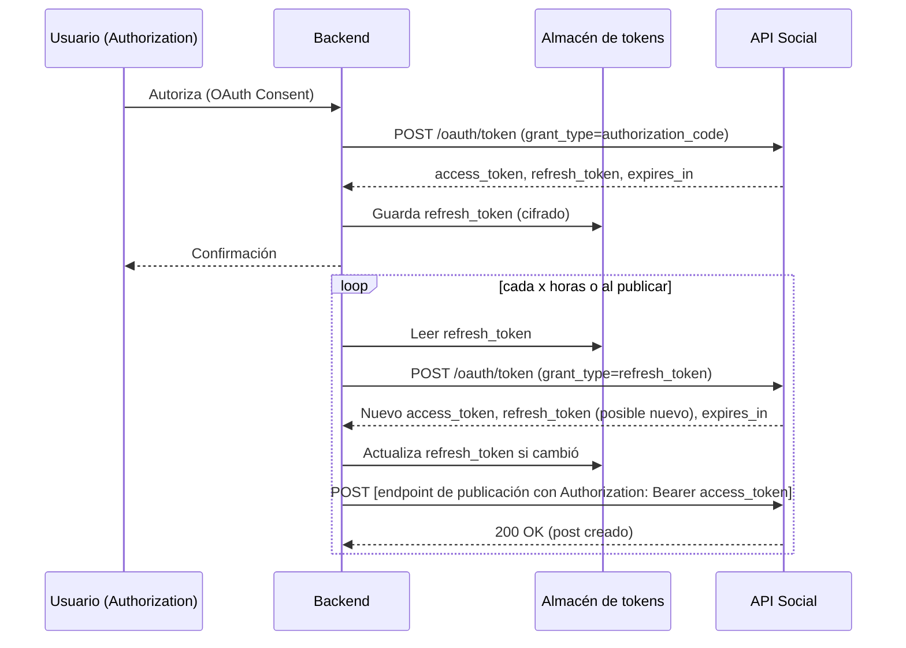

# Resumen ejecutivo  
Para evitar las re-autenticaciones manuales en Make, **la solución es manejar los tokens OAuth fuera de Make**. En la práctica se crea un **backend propio** (Node.js, Python, etc.) que almacena de forma segura los *refresh tokens* y renueva automáticamente los *access tokens* cuando caducan. Make se usa solo como disparador (webhook) o para orquestar el flujo, mientras que las llamadas finales a las APIs de redes sociales las hace el backend usando los tokens internos. Esta arquitectura permite que Make sólo ejecute los escenarios (por ejemplo, publicar posts), sin depender de sus módulos nativos de conexión (que requieren re-login).  

Las claves del enfoque son:  
- **OAuth personalizada**: Registrar apps propias en Google, Meta, Twitter, TikTok para obtener client_id/secret. Solicitar permisos de “offline” para obtener *refresh tokens* duraderos.  
- **Almacenamiento seguro**: Guardar *refresh tokens*, client_id/secret en un almacén cifrado (base de datos o vault). Nunca exponerlos en frontend.  
- **Refresco automático**: Programar procesos (cron jobs o endpoints) que, antes de cada publicación, intercambien el *refresh token* por un nuevo *access token* (y reemplacen el refresh si cambia). Por ejemplo, Google/Meta/TikTok ofrecen endpoints para “grant_type=refresh_token”【31†L431-L440】【53†L183-L192】.  
- **Publicación desde backend**: El backend se comunica directamente con las APIs oficiales (Google Drive, Facebook Graph, Twitter API, TikTok API) usando las bibliotecas o solicitudes HTTP. Así respeta los Términos de Servicio (es “legal” según sus reglas) y evita detectores anti-bot.  
- **Integración con Make**: Los escenarios de Make pueden dispararse vía webhook o llamadas API, y pueden usar el módulo HTTP para invocar al backend (por ejemplo, `POST /publish_post` con datos del contenido). Make también dispone de su propia API para ejecutar escenarios desde código【44†L1239-L1247】.  

En resumen, **sí es viable**. Muchas agencias y automatizaciones avanzadas gestionan OAuth externamente y usan Make solo para orquestar el flujo. Por ejemplo, se registra un proyecto de Google en *Producción* (los tokens dejan de expirar cada 7 días【19†L127-L136】), se crean tokens de larga duración en Meta (60 días extendibles【53†L183-L192】), y el backend se encarga de renovarlos automáticamente. Solo en casos sin API (Instagram personal, TikTok sin permisos) recurriría a Selenium, pero esto tiene riesgos (anti-bot, TOS)【56†L189-L198】【56†L227-L234】. La arquitectura recomendada es híbrida: Make + Webhooks + backend con gestión de tokens. 

A continuación se detallan cada aspecto: diagramas, pasos técnicos, ejemplos y recomendaciones.  

---

## 1. Arquitectura propuesta (diagrama)  
```mermaid
flowchart LR
    A[Backend / App Propio] -->|Webhook o HTTP| B[Escenario Make]
    B -->|HTTP Module ó App nativo| C[Redes Sociales (APIs)]
    C -->|Respuesta| B
    subgraph Tokens
        D[(Base de Datos segura)]
        E[(Key Vault / Secrets)]
    end
    A -->|Lectura/Escritura de tokens| D
    A -->|Configuración (IDs, secretos)| E
```
En esta arquitectura, **Make** solo ejecuta el escenario tras un disparador (p.ej. webhook programado o evento de la app). El backend propio gestiona los tokens en un almacén seguro. Make puede llamar al backend vía módulo HTTP (ej. `POST https://mi-backend.com/publish`) o viceversa, pero en general el backend invoca a las APIs sociales directamente usando los tokens internos. De este modo, **Make no necesita reconectar manualmente cada cuenta**; la gestión OAuth queda totalmente en el servidor.

Otro diagrama de flujo de tokens para un proveedor típico (p.ej. Google, Facebook, TikTok):


Así, cuando *expires_in* llega a 0, el backend automáticamente usa el *refresh_token* para obtener uno nuevo sin intervención humana【31†L431-L440】【53†L183-L192】.

---

## 2. Limitaciones actuales de Make con OAuth  
Make ofrece módulos nativos para Google Drive, Facebook, etc., que usan OAuth 2.0 internamente. Sin embargo:

- **Refresh tokens cortos en Testing**: Si en Google Cloud el OAuth está en modo *Testing*, los refresh tokens expiran en 7 días【19†L127-L136】. En producción duran mucho más.  
- **Make no renueva tokens exp.**: Make renueva automáticamente los *access tokens* SI el *refresh token* aún es válido【19†L127-L136】. Pero cuando un refresh expira (p.ej. 7 días), Make no puede más y pide reconexión manual.  
- **Cambios de API y permisos**: Ej. Twitter ha hecho cambalaches recientes en OAuth que rompieron integraciones.  
- **Cuentas Business**: Instagram por ejemplo obliga a usar Facebook Graph API con tokens de página. Esto ya es complejo vía Make.  
- **No hay API Make para reconectar**: La API oficial de Make solo gestiona escenarios, no puede renovar conexiones OAuth de servicios externos.  

En la comunidad se reportan errores típicos como *“Failed to verify connection: Invalid refresh token”* cuando tokens caducan【19†L127-L136】. La solución pasa por la configuración del proyecto (app en Producción) o por gestionar manualmente la renovación.  

---

## 3. Gestión de tokens en un backend propio  

**Viabilidad:** Totalmente viable. De hecho, es la práctica recomendada para sistemas robustos. El flujo general es:

1. **Registrar apps en cada plataforma:** 
   - *Google*: Crear un proyecto en Google Cloud, habilitar APIs (Drive, Sheets, etc.), configurar pantalla de consentimiento con “tipo externo” y **modo Producción** para que el refresh token sea indefinido【19†L127-L136】.
   - *Meta (Facebook/Instagram)*: Crear una App en Meta for Developers, solicitar scope para publicar (p.ej. `pages_manage_posts`), generar *User Access Token* de prueba y luego extenderlo a **long-lived** (60 días)【53†L183-L192】.
   - *Twitter/X*: Crear una App, usar OAuth1.0a (no expira) o OAuth2.0 con scope `offline.access` (refresh tokens). (OAuth1 produce tokens permanentes hasta que el usuario revoca.)
   - *TikTok*: Registrar TikTok for Developers app, usar OAuth2 v2.0. Se obtiene un *access_token* (24h) y *refresh_token* (365 días)【31†L431-L440】.
   
2. **Endpoints de Backend:** Implementar rutas seguras, por ejemplo:  
   - `POST /auth/callback/google` – guarda `refresh_token` tras el primer login.  
   - `POST /token/refresh/google` – usa el refresh para obtener nuevo access.  
   - `POST /post/facebook` – publica a FB/IG usando tokens almacenados.  
   - (Similar para Twitter, TikTok).  
   
3. **Almacenamiento seguro:**  
   - Guardar los `refresh_token` y secretos en una base de datos cifrada o en un vault. Rotar claves periódicamente. Nunca exponer `client_secret` en front-end ni logs públicos.  
   - Encryptar los datos sensibles (AES, KMS, etc.) y limitar acceso solo al backend.  

4. **Renovación automática:**  
   - Programar un trabajo (cron) o utilizar un bucket de mensajes (queue) para refrescar tokens antes de publicar. Por ejemplo, **cada 60 días para Facebook** o **cada 23h para TikTok** (antes de expiración).  
   - Hacer la llamada de refresh con un simple HTTP:  
     - *Google:* `POST https://oauth2.googleapis.com/token` con `{ grant_type: 'refresh_token', refresh_token, client_id, client_secret }`.  
     - *Facebook:* `GET https://graph.facebook.com/v16.0/oauth/access_token?grant_type=fb_exchange_token&client_id={id}&client_secret={secret}&fb_exchange_token={user_token}` para extender token. O para páginas: usar el *user token* en `/me/accounts` y tomar el token de página, que es indefinido si se genera con un token extendido (ver documentación Meta).  
     - *Twitter:* Con OAuth1 basta; con OAuth2, usar `POST oauth2/token` con `grant_type=refresh_token`.  
     - *TikTok:* `POST https://open.tiktokapis.com/v2/oauth/token/` con `{grant_type: 'refresh_token', refresh_token, client_key, client_secret}`【31†L431-L440】.  

5. **Publicación:** Una vez con `access_token` válido, el backend realiza la petición final:  
   - Ejemplo Node/Python (Facebook Graph):  
     ```python
     import requests
     data = {"message": "Hola Mundo!"}
     headers = {"Authorization": f"Bearer {access_token}"}
     res = requests.post(f"https://graph.facebook.com/v16.0/me/feed", params=data, headers=headers)
     ```  
   - Ejemplo Node (Google Drive upload):  
     ```js
     const { google } = require('googleapis');
     const drive = google.drive({version: 'v3', auth: oauth2Client});
     drive.files.create({media: {body: fs.createReadStream('image.jpg')}})
     ```  
   Estos ejemplos usarían los tokens obtenidos por el backend.  

**Casos reales:** Varios usuarios comentan que así evitan las fallas de Make. Por ejemplo, un experto de Make sugiere guardar tokens en Data Store e intercambiarlos manualmente【49†L75-L84】. Otros interceptan el flujo OAuth con su propio webhook para cachear tokens【49†L121-L128】. Esta estrategia “Keep-alive” de tokens es la base de cualquier sistema SaaS social media.

---

## 4. Ejemplos técnicos concretos  

### Google APIs (Drive, Sheets, etc.)  
- **Cliente OAuth:** En el proyecto Google Cloud, obtener `client_id`/`client_secret`. Poner redirect URI (no público para backend, p.ej. `https://miapp.com/auth/google/callback`).  
- **Obtención inicial (code):** El usuario autoriza y el backend intercambia `code` por tokens:  

  ```python
  # Python example using requests
  resp = requests.post("https://oauth2.googleapis.com/token", data={
      "code": code,
      "client_id": CLIENT_ID,
      "client_secret": CLIENT_SECRET,
      "redirect_uri": REDIRECT_URI,
      "grant_type": "authorization_code",
  })
  tokens = resp.json()
  # tokens contiene access_token, refresh_token, expires_in
  save_to_db(tokens["refresh_token"])
  ```
- **Renovación:** Cuando expire el *access_token*, o como job diario:
  ```python
  refresh_token = get_from_db()
  resp = requests.post("https://oauth2.googleapis.com/token", data={
      "client_id": CLIENT_ID, "client_secret": CLIENT_SECRET,
      "refresh_token": refresh_token, "grant_type": "refresh_token"
  })
  new_tokens = resp.json()
  save_to_db(new_tokens["refresh_token"])  # si cambia
  access_token = new_tokens["access_token"]
  ```
- **Uso del token:** Luego se usan las librerías Google (p.ej. `google-auth-oauthlib`) o peticiones directas autorizadas con `Authorization: Bearer {access_token}` para subir archivos o acceder a Sheets.

**Service Accounts (Google):** Son alternativas “server-to-server”. Si los recursos están en Google Workspace (empresa), se puede crear un Service Account con delegación de dominio, lo que evita por completo tokens de usuario. Sin embargo, **los service accounts NO pueden acceder a cuentas personales de Google ni archivos fuera de un dominio con permisos compartidos**【32†L25-L33】. En resumen, útiles para entornos corporativos (Drive en Shared Drives), pero con limitaciones: no sustituyen OAuth de usuario común. 

### Facebook/Instagram (Graph API)  
- **User Access Token extendido:** Tras login de un usuario, obtenemos un *short-lived token*. Lo intercambiamos por un *long-lived token* (~60d):  
  ```http
  GET https://graph.facebook.com/v16.0/oauth/access_token?
      grant_type=fb_exchange_token&
      client_id={APP_ID}&
      client_secret={APP_SECRET}&
      fb_exchange_token={short_lived_token}
  ```
  El resultado da `access_token` y `expires_in`.  
- **Publicación:** Para publicar en una Página de Facebook o Instagram, primero el usuario debe dar permisos de gestión de páginas. Se consulta `/me/accounts` para obtener el *page_access_token* de la página deseada, el cual **no expira** (debe renovarse solo si el usuario deja de tener permisos). Con ese token inamovible se hace el POST:  
  ```http
  POST https://graph.facebook.com/v16.0/{page_id}/feed
  Authorization: Bearer {page_access_token}
  ```  
- **Refresco automático:** Los tokens de usuario 60d se renuevan *automáticamente* con cada uso de la API【53†L183-L192】. En la práctica, si tu backend hace llamadas periódicas, Facebook extiende el token continuamente. No obstante, es buena práctica comprobar 1 vez al mes la validez (Facebook avisa antes si hay cambio de políticas).  
- **Cuentas Instagram Business:** En Instagram Graph API, el flujo es similar (cuentas business ligadas a página FB). Se obtiene el token de Instagram vía Graph y se publica con endpoints específicos (`/user_id/media` y `/user_id/media_publish`).  

### Twitter/X  
- **OAuth1.0a (Legacy):** Para publicar como una cuenta, se suele usar OAuth1.0a con API v1.1. Aquí el `access_token` (y `access_token_secret`) son “permanentes” hasta que el usuario revoca la aplicación【56†L189-L198】. No hay refresh automático, simplemente se guardan esos tokens en backend y se usan.  
- **OAuth2.0 (Bearer):** Twitter introdujo OAuth2.0 para acceso de solo lectura, pero para escribir (tweets) aún se usa OAuth1, o bien OAuth2 con PKCE (requiere refresh). Con OAuth2 con scope `offline.access`, se obtiene refresh_token. Ejemplo (v2 API):  
  ```http
  POST https://api.twitter.com/2/oauth2/token
  grant_type=refresh_token
  refresh_token={stored_refresh}
  client_id={CLIENT_ID}
  ```
  En respuesta vienen nuevos tokens. Este enfoque es menos usado para bots, ya que OAuth1 es más sencillo para publicación.  

### TikTok (TikTok for Business API)  
- **Obtención inicial:** Usuarios autorizan la app vía OAuth2.0. Se POST a `https://open.tiktokapis.com/v2/oauth/token/` con `grant_type=authorization_code`. Respuesta incluye `access_token (24h)`, `refresh_token (365d)`【31†L431-L440】.  
- **Renovación:** Se programa un refresh, POST al mismo endpoint con `grant_type=refresh_token`. Ejemplo JSON request con cURL:  
  ```bash
  curl -X POST 'https://open.tiktokapis.com/v2/oauth/token/' \
    -H 'Content-Type: application/x-www-form-urlencoded' \
    --data 'client_key=TU_CLIENT_KEY&client_secret=TU_SECRET&grant_type=refresh_token&refresh_token=TU_REFRESH_TOKEN'
  ```  
  La respuesta devuelve un nuevo `access_token` y **posiblemente un nuevo `refresh_token`**. Actualiza ambos en el almacén.  
- **Publicación:** Con el `access_token`, se invoca el endpoint de publicación de videos/posts de TikTok (p.ej. `POST /media/video/upload/` y luego `/media/video/commit/` según la API), incluyendo el token en el header.  

En todos los casos, el flujo es semejante: el backend envía `{client_id, secret, refresh_token}` y recibe `{new_access_token, new_refresh_token}`; luego usa `new_access_token` para la acción deseada. Cada proveedor define sus rutas y parámetros, pero existen documentaciones oficiales (Google, Meta, TikTok) y guías en la comunidad.  

---

## 5. Integración con Make  

- **Webhooks (disparadores):** Make permite crear “Webhooks” personalizados【42†L159-L168】. Por ejemplo, tu backend puede llamar `https://hook.make.com/xxxxx` para iniciar un escenario tras generar contenido. O Make puede usar webhooks para recibir eventos.  
- **Módulo HTTP:** Dentro de un escenario Make, usar el módulo *HTTP* permite llamar a tu backend o a APIs externas. Puedes configurar método, URL, headers y body, incluso usando datos del escenario. Ejemplo de llamada HTTP en Make (pseudo-configuración):  
  ```json
  {
    "module": "HTTP",
    "action": "Make a request",
    "method": "POST",
    "url": "https://mi-backend.com/api/publish",
    "headers": {
        "Authorization": "Bearer {{conexion.mi_api}}"
    },
    "body": {
        "text": "Hola desde Make!"
    }
  }
  ```  
  Aquí `{{conexion.mi_api}}` sería un token o variable almacenada.  
- **Make API:** Opcionalmente, puedes iniciar escenarios usando la API REST de Make【44†L1239-L1247】. Por ejemplo, tu backend podría hacer `POST https://api.make.com/v2/scenarios/{id}/run` con su API token para activar el flujo, en lugar de usar webhook. Esto requiere mantener un *API Token* de Make.  
- **Escenario híbrido:** Un uso común es: Make genera el contenido (p.ej. texto con IA, selecciona imágenes) y al final llama a tu backend para la publicación real. De esta forma, Make maneja la lógica visual y el contenido, y el backend la interacción con APIs sociales.  

**Ejemplo de flujo con Make:**  
1. **Webhook disparador:** Programado (p.ej. cada día) o disparado desde tu app.  
2. **Transformación de datos:** Make puede usar módulos (OpenAI, Sheets, etc.) para preparar el post (texto, imagen).  
3. **HTTP a Backend:** Al final, Make usa “HTTP Request” apuntando a `POST https://mi-backend/publish` con el payload del post (texto, URL imagen).  
4. **Backend envía a la red:** El backend recibe esos datos y con los tokens relevantes (Google Photos, Facebook, etc.) publica el post vía API.  

Las integraciones nativas de Make (por ejemplo “Facebook Pages – Create a Post”) podrían usarse si deshabilitas la función de reconexión automática, pero en general no resuelven el problema de re-autenticación. Por eso la tendencia es usar **módulo HTTP personalizado** para tener control total.

---

## 6. Riesgos y Términos de Servicio  

- **Uso de APIs oficiales:** Publicar mediante APIs oficiales (Google Drive API, Graph API, etc.) cumple la mayoría de términos de servicio de las plataformas. Es la forma **recomendada** y segura. No obstante, cada API tiene sus propios límites (ratelimit, número de posts/día).  
- **Evitar Selenium/Screen-scraping:** Automatizar UI con Selenium o "Web drivers" en redes sociales es muy riesgoso. Muchos desarrolladores advierten que **detectarás bots** y violarás los ToS. Como resumió un experto en Reddit: *“si hay API oficial, úsala. Si no, y necesitas Selenium para evadirlas, probablemente estés rompiendo ToS y serás baneado”*【56†L189-L198】. Las grandes redes emplean detectores sofisticados para bloquear acceso automatizado no autorizado【56†L227-L234】.  
- **Rotación de llaves:** Es crucial rotar y proteger los `client_secret`, `refresh_tokens` y otros credenciales. Recomiendan almacenarlos en entornos seguros (variables de entorno, AWS Secrets Manager, etc.) y no hard-codearlos. Hacer logging solo de errores, no de tokens.  
- **Limitaciones del plan gratuito de Make:** Si usas la versión free de Make, ten en cuenta que hay límites: ~1000 operaciones/mes y pocos escenarios activos【50†L1-L4】. Si tu automatización requiere mucho posteado (múltiples redes, imágenes, etc.), podrías agotarlos rápido. Recomienda optimizar: agrupar acciones, usar módulos nativos con “compuesto” (aggregator) y verificar consumo. Para pilas críticas, considera un plan pago.  
- **Seguridad adicional:** Garantizar HTTPS en todos los endpoints; CORS apropiado si es necesario. Implementar reintentos con backoff en los refresh en caso de fallo temporal. Manejar errores 4xx/5xx de las APIs (p.ej. revocación de token), para re-autenticar manualmente si es inevitable.  

**Pasos de seguridad y buenas prácticas**:  
- Cifrar tokens sensibles en la base de datos (AES-256, etc.).  
- Usar OAuth “PKCE” o flujos recomendados (p.ej. para Twitter OAuth2).  
- Auditar los scopes solicitados: pide solo los necesarios.  
- Vigilar cuotas de API (usar métricas de Google Cloud, Analytics de Graph API, etc.).  
- Automatizar notificaciones si un token se revoca o expira inesperadamente.  

---

## 7. Casos de éxito y soluciones de la comunidad  

En foros y comunidades se ha compartido cómo resolver estos bloqueos:  

- **Google (7-días):** Varios usuarios confirman que migrar el proyecto de Google a **Producción** elimina la expiración semanal【19†L127-L136】. Esto requiere verificar la app si se usan scopes sensibles, pero para uso interno a veces es posible pasar a producción sin revisión (con una advertencia al usuario).  
- **Make Data Store:** Algunos usan un módulo “Data Store” de Make para guardar los tokens y refrescarlos dentro de escenarios separados【49†L75-L84】. Esto es una solución “dentro de Make”: un escenario chequea la expiración (o recibe un error) y ejecuta el flujo de refresh manual, actualizando el store. Sin embargo, sigue siendo compleja.  
- **Proxy OAuth o Backend propio:** Tal como hemos señalado, es común delegar OAuth a un servidor externo. Por ejemplo, Google Apps Script con triggers, o un servicio Node corriendo en AWS que interfasea con Facebook Graph, etc. (Esto se discute en posts técnicos de agencias).  
- **Evitar cuentas de prueba:** Para todas las APIs (Google, Twitter, etc.), usar cuentas de producción o enterprise. Las “cuentas de desarrollador” suelen tener límites más estrictos y tokens más cortos.  
- **Discord/r/Make y r/Integromat:** Usuarios hispanos y anglosajones comparten snippets: uno sugiere crear “un módulo Universal” propio en un *Custom App* de Make, para un único punto de autenticación【49†L109-L118】, aunque es trabajo de desarrollo.  

**Anti-patrón:** Quedarse atado a conectores nativos sin alternativa. Por ejemplo, usar siempre el módulo “Google Drive – Upload file” en Make provocará re-logins periódicos. En su lugar, un anti-patrón es usar el módulo *HTTP* con tu propio token.  

**Consulta en español:** No se encuentran tutoriales muy extendidos en castellano sobre este tema específico, lo que subraya que es un tema avanzado. Sí hay blogs en inglés de marketing automation que comentan el uso de APIs templadas en Make【14†L275-L284】【53†L183-L192】.  

---

## 8. Comparativa de enfoques (pros y contras)  

| Enfoque                  | Ventajas                                           | Desventajas                                    | Cuándo usar                          |
|--------------------------|----------------------------------------------------|------------------------------------------------|--------------------------------------|
| **1) Todo en Make (conectores nativos)**  | - Muy fácil de configurar (no-code).<br>- Cubre muchos servicios con módulos pre-hechos.【49†L75-L84】 | - Tokens caducan, provocando paros semanales/mensuales. <br>- Menos control de fallos. | Flujo simple, pocos posts, escenarios no críticos. |
| **2) Make + HTTP a backend**  | - Control total de OAuth y tokens.<br>- Usa APIs oficiales sin re-log.<br>- Escalable (cambia tokens cuando quieras). | - Requiere desarrollo backend adicional.<br>- Más puntos de fallo (tu server). | Uso medio/alto, varias redes, libertad de programar lógica. |
| **3) Backend solo (sin Make)** | - Máxima flexibilidad.<br>- Opciones avanzadas de devOps.<br>- Escalable estilo SaaS (colas, worker, etc.). | - Se pierde interfaz visual de Make.<br>- Todo código propio. | Proyectos de gran escala, equipos de dev ops, SaaS. |
| **4) Selenium o UI Automation**| - Puede usarse donde no hay API (ver abajo). | - Fuertemente violatorio de ToS.【56†L189-L198】<br>- Mantenimiento alto (cambios UI, CAPTCHAs). | **Desaconsejado.** Sólo si API inexistente (y aún así es riesgo). |

**Checklist de implementación:**
- [ ] Crear OAuth apps en Google Cloud, Meta Developer, Twitter, TikTok. Configurar scopes correctos.  
- [ ] Llevar Google a “Producción” en consent screen【19†L127-L136】.  
- [ ] Establecer endpoints del backend: `/auth/callback`, `/token/refresh`, `/post/facebook`, etc.  
- [ ] Implementar almacenamiento seguro (env vars, vault, BD cifrada).  
- [ ] Programar lógica de refresh según doc oficial (vean ejemplo TikTok【31†L431-L440】).  
- [ ] En Make: crear escenario con Webhook o HTTP, ajustando inputs/outputs.  
- [ ] Probar publicación manualmente, después automatizar disparos.  
- [ ] Configurar alertas (email/slack) si falla un refresh/token inválido.  
- [ ] Documentar claves y rotaciones regulares.  

---

## 9. Recomendaciones adicionales  

- **Make versión gratuita:** Utiliza al máximo el plan free optimizando operaciones (por ejemplo, en un escenario en cola usar agregación de datos para publicar varios posts en un solo escenario). Considera contratar plan pago si superas 1.000 ops/mes【50†L1-L4】.  
- **Seguridad:** Usa HTTPS siempre, habilita CORS solo si es necesario, no expongas endpoints sensibles al público. Haz *rate-limiting* en tus rutas para evitar abusos.  
- **Monitoreo:** Implementa logs y métricas. Herramientas como Sentry o DataDog pueden ayudar a detectar si un token falla repentinamente (por ejemplo, si la contraseña del admin cambia, etc.).  
- **Desarrollo de código:** Cuando escribas código para refresh o publicación, maneja errores OAuth (invalid_grant, etc.) para intentar un re-login o notificar al usuario.  

**Fuentes:** Este informe se basa en documentación oficial (Make Developer Hub, Google/TikTok/Meta Dev docs) y experiencias reportadas en comunidades técnicas【19†L127-L136】【31†L431-L440】【53†L183-L192】【49†L75-L84】【56†L189-L198】. En resumen, desplazar la lógica OAuth a tu backend es la solución más sólida para automatizar posts de redes sociales con Make sin interrupciones manuales. 

